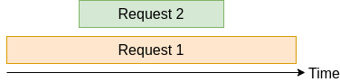
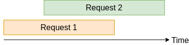

# Multi-thread awareness for default writer in trace.zig 0.3.0

[trace.zig](https://gitlab.com/zig_tracing/trace.zig) is a small and simple
tracing client library for Zig. It aims to fill the gap until `std` provides a
better and more sophisticated implementation. It is also a learning Zig project
for myself. You can find the basic usage and concepts of trace.zig in the 0.1.0
announcement article 
[here](https://zig.news/huntrss/tracezig-a-small-and-simple-tracing-client-library-2ffj).

I recently released version 0.3.0 of this library that tackled the issue No. 5
[Consider multi-threading for default writer](https://gitlab.com/zig_tracing/trace.zig/-/issues/5).

The default writer, writes the trace points to `std.log.info` but it did not
consider or was aware of multi-threading.

## The problem

Imagine you have some application that handles requests (maybe a simple
server) as they come and go by using one thread per request. Some requests
take longer to process, some shorter. Some requests are processed in parallel.
All of them are processed by the same function. Assume you're using `trace.zig`
to trace your application. You may've collect a trace as shown below:

```bash
info: ;tp;5406903957614;0;processRequest # this is a span open
info: ;tp;5406929313234;0;processRequest # this is a span open
info: ;tp;5406954247671;1;processRequest # this is a span close
info: ;tp;5406979588282;1;processRequest # this is a span close
```

This means two requests are processed in parallel. What is not clear from this
trace is, which request is finished first, which one is finished last. Also it
is not clear if the first request (the one with timestamp 5406903957614) is
the one that finishes before the second. This means one of the two
situations may have occurred:

* Request 1 takes longer than request 2:

  

* Request 1 finishes first:

  

It is impossible to know what is the situation out of the trace points that were logged. The data contained in a logged trace point is not enough for such situations.

## The solution

